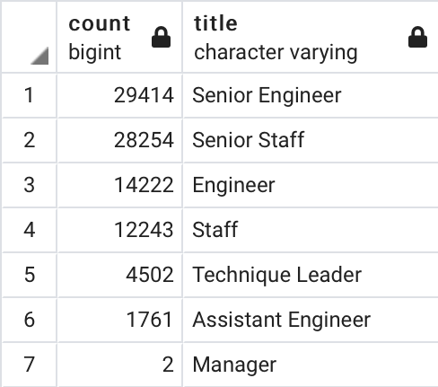
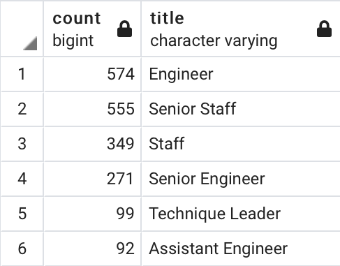

# Pewlett Hackard Analysis

## Overview
The function of this analysis is to assist the Pewlett Hackard Human Resources Manager in measuring the number of employees approaching retirement and prepare succession planning efforts through a mentorship program in which Pewlett Hackard employees nearing retirement may work part-time to prepare junior staff members to fill more advanced roles.

According to the Center for Retirement Research at Boston College, 2016 U.S. Census Bureau found that American workers are retiring in their early to mid 60’s. We have identified employees born between 1952 and 1955, or employees between the ages of 65 and 68. Many of these employees are expected to retire within the next five years. 

We have also identified candidates for a strategic mentorship program. Workers born in 1965 may be suitable to mentor junior-level employees to back-fill positions left open by departing retirees. This program is designed to reduce the number of outside hires and increase employee loyalty and retention.

## Results
  - Over one third of the Pewlett Hackard workforce is set to retire in the coming years. 133,776 out of approximately 300,000 employees may be departing from the workforce, certainly resulting in a skills gap for which Pewlett Hackard will want to strategize.

  - Most of these roles require a specific level of education, training, or experience. Over 29,000 engineers are approaching retirement, yet these positions may be difficult to fill as a result of the required skillset for this position. 

  - Managers at Pewlett Hackard have determined that a mentorship program may help them leverage the current pool of junior employees to fill many of the positions left open by those retiring. 1,940 employees have been identified as mentors to assist in the coaching of advancing junior- or mid-level employees.

  - The number of employees eligible to enter the mentorship program is considerably lower than the number of employees heading for retirement. Managers and the Human Resources staff at Pewlett Hackard will need to prepare to fill quite a large number of roles. Promoting from within will remain a key strategy to fill key roles such as Senior Staff and Senior Engineers.

## Summary

Shown above, there are 133,776 total roles that may need to be filled as the retirees begin to take their leave. 29,414 of those positions are Senior Engineers while 14,222 are Engineers and 1,761 are Assistant Engineers. 28,254 of these positions are Senior Staff and 12,243 are Staff roles. 2 Managers and 4,502 Technique Leaders are also slated for retirement. 

Our analysis has determined that 1,940 current Pewlett Hackard employees may be eligible to serve as mentors in the mentorship program. Unfortunately, we do not have enough mentors to develop a one-to-one mentor to mentee program. In some cases, such as Managers approaching retirement, there are no employees positioned to mentor an advancing employee. However, we may be able to capitalize on our early planning efforts by matching mentors to two or three mentees and begin the succession process early, alleviating some of the work required of the mentors as they transition to part-time status. 

Further analysis needs to be conducted to determine whether or not there are enough Pewlett Hackard employees qualified to fill all of the positions opening up. Some roles may need to be filled by outside hires, especially as we begin filling open positions from within. Developing or updating an already existing employee referral program may reduce the recruitment efforts involved.

## References
Center for Retirement Research at Boston College. [Average Retirement Age for Men and Women, 1962-2016](http://crr.bc.edu/wp-content/uploads/2015/10/Avg_ret_age_men.pdf).

